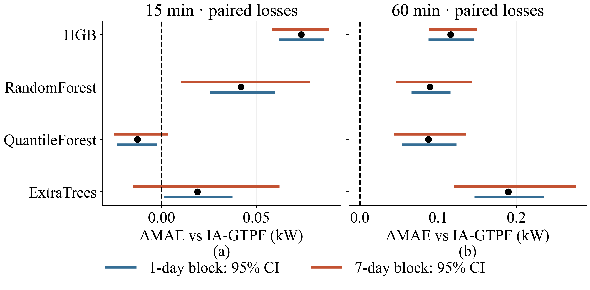
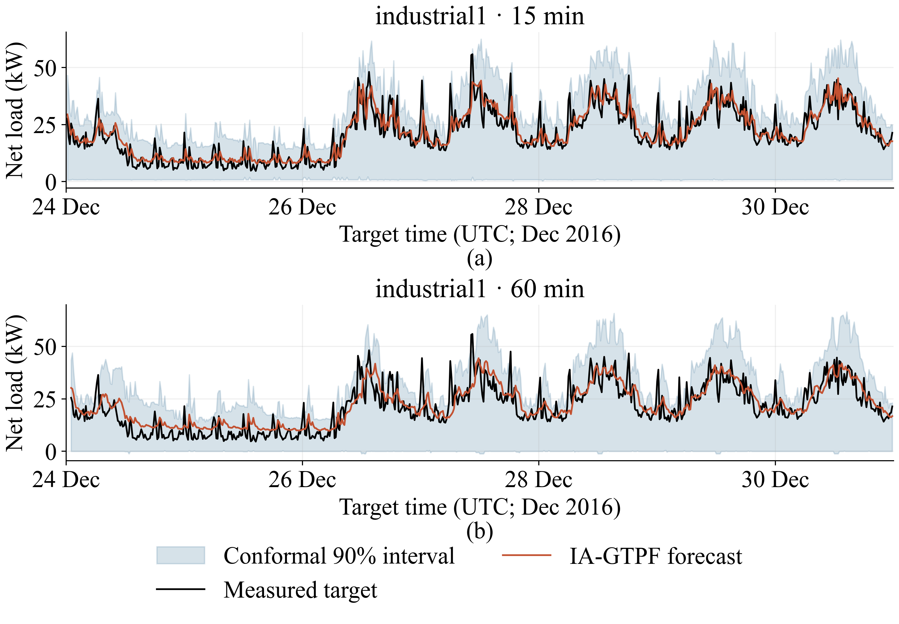
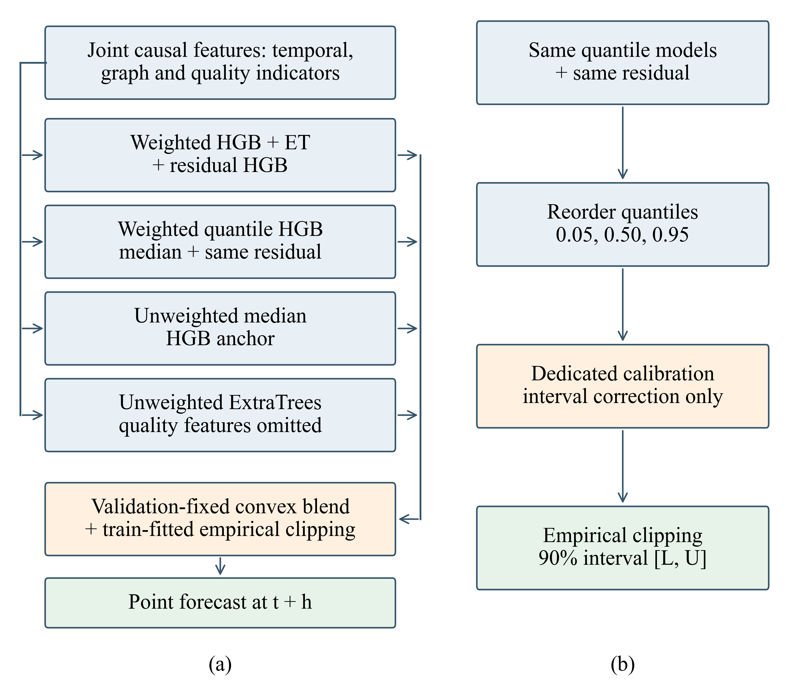

# ⚡ IA-GTPF Prosumer Forecasting

**Causal graph–temporal features, hybrid tree ensembles and calibrated uncertainty for short-term net-load forecasting.**

IA-GTPF is a Python research workflow that forecasts prosumer net load **15 and 60 minutes ahead** from original cumulative smart-meter measurements. It combines temporal dynamics, training-derived relationships between sites, input-quality information, residual correction and separately calibrated prediction intervals.

| 🏘️ Primary cohort | ⏱️ Forecast horizons | 🔁 Repeated evaluation | 📓 Included workflow |
|:---:|:---:|:---:|:---:|
| 9 industrial / residential sites | 15 and 60 minutes | 5 seeds · 5 temporal origins | 7 notebooks with saved results |

[Results](#results) · [Method](#method) · [Experimental design](#experimental-design) · [Setup](#setup) · [Notebook guide](#notebooks) · [Data](dataset/README.md) · [Figure gallery](figures/README.md)

## 🔎 Research overview

Distributed photovoltaic generation and heterogeneous building demand create net-load trajectories with different temporal patterns, sharp changes and incomplete measurement coverage. This repository studies how a reproducible forecasting pipeline can use those observations while retaining the distinction between measured and supplier-filled values.

The workflow provides causal reconstruction of power from cumulative counters, a shared chronological evaluation calendar, comparisons with classical and compact neural models, and interval calibration on a separate period. Its experiments examine point accuracy, interval sharpness and coverage, performance across temporal origins, and the contribution of individual model components.

**Principal findings from the stored experiment:**

- **60-minute point forecasting:** IA-GTPF achieves MAE **1.3940 kW**, RMSE **4.2017 kW** and R² **0.9712**. Its paired MAE reduction against ExtraTrees is **11.97%**, with a positive seven-day block confidence interval.
- **15-minute forecasting:** QuantileForest has the lowest MAE, **0.9695 kW**; IA-GTPF records **0.9824 kW** and the lowest RMSE, **2.5408 kW**, among the evaluated full-test models. IA-GTPF's smaller MAE gain against ExtraTrees is sensitive to the treatment of temporal dependence.
- **Uncertainty:** IA-GTPF's nominal 90% intervals reach **91.01% / 92.52% coverage**, but QuantileForest yields narrower intervals and lower interval scores. Conditional coverage remains uneven.
- **Component evidence:** removing the probabilistic branch from point aggregation increases paired mean MAE at both horizons. Graph and residual ablations have confidence intervals that include zero in the repeated temporal experiment.

All headline numbers below are linked to the supplied CSV tables. The scope is the recorded dataset, chronological partitions and evaluated model configurations.

<a id="results"></a>

## 📊 Final test results


The primary experiment uses nine industrial and residential sites with a shared calendar. Model selection, interval calibration and final evaluation use separate chronological periods. The final measured-target sets contain **32,527 observations at 15 minutes** and **32,504 at 60 minutes**. Stochastic model scores are averaged across five seeds; deterministic models have one run. Errors are computed over eligible site/timestamp observations in the common test period.

| Model | MAE, 15 min (kW) | RMSE, 15 min (kW) | MAE, 60 min (kW) | RMSE, 60 min (kW) |
|---|---:|---:|---:|---:|
| Persistence | 1.0338 | 2.6691 | 1.5131 | 4.6793 |
| ExtraTrees | 1.0013 | 2.5542 | 1.5836 | 4.4590 |
| QuantileForest | 0.9695 | 2.5473 | 1.4817 | 4.4265 |
| STGCN | 1.3156 | 3.2524 | 1.8529 | 4.9146 |
| IA-GTPF | 0.9824 | 2.5408 | 1.3940 | 4.2017 |

[Complete model comparison](artifacts/final_main_model_comparison.csv) · [Per-run metrics and target sensitivity](artifacts/main_model_metrics.csv)

QuantileForest has the lowest 15-minute MAE among the evaluated models; IA-GTPF has the lowest 60-minute MAE. Against ExtraTrees, the paired IA-GTPF MAE reduction is **0.0189 kW (1.89%)** at 15 minutes and **0.1896 kW (11.97%)** at 60 minutes. The 15-minute improvement is sensitive to the dependence assumption: its seven-day block confidence interval includes zero.

| Horizon | ΔMAE versus ExtraTrees (kW) | 95% CI, daily blocks (kW) | 95% CI, seven-day blocks (kW) |
|---|---:|---:|---:|
| 15 min | 0.0189 | [0.0011, 0.0374] | [−0.0150, 0.0622] |
| 60 min | 0.1896 | [0.1463, 0.2348] | [0.1199, 0.2754] |

Positive ΔMAE favors IA-GTPF. These confidence intervals use paired losses with seed averaging at identical site/timestamp keys. [Paired statistics, block sensitivity and adjusted p-values](artifacts/paired_statistical_summary.csv).




<details>
<summary><strong>Complete 16-model comparison</strong></summary>

MAE and RMSE are in kW; R² is dimensionless. Values are arithmetic means over the recorded seeds. Conformalized ExtraTrees shares its point forecasts with ExtraTrees and adds interval calibration.

| Model | 15 min MAE | 15 min RMSE | 15 min R² | 60 min MAE | 60 min RMSE | 60 min R² |
|---|---:|---:|---:|---:|---:|---:|
| Persistence | 1.0338 | 2.6691 | 0.9884 | 1.5131 | 4.6793 | 0.9643 |
| Seasonal Persistence | 2.6343 | 9.5179 | 0.8522 | 2.6360 | 9.5210 | 0.8522 |
| Ridge | 1.0879 | 2.5716 | 0.9892 | 1.8196 | 4.2341 | 0.9708 |
| HGB | 1.0560 | 2.6491 | 0.9886 | 1.5099 | 4.3109 | 0.9697 |
| RandomForest | 1.0243 | 2.5677 | 0.9892 | 1.4837 | 4.2517 | 0.9705 |
| ExtraTrees | 1.0013 | 2.5542 | 0.9894 | 1.5836 | 4.4590 | 0.9676 |
| QuantileHGB | 1.0312 | 2.6734 | 0.9883 | 1.4571 | 4.3584 | 0.9690 |
| QuantileForest | 0.9695 | 2.5473 | 0.9894 | 1.4817 | 4.4265 | 0.9681 |
| Conformalized ExtraTrees | 1.0013 | 2.5542 | 0.9894 | 1.5836 | 4.4590 | 0.9676 |
| DLinear-lite | 1.6097 | 3.9297 | 0.9692 | 1.9841 | 5.4041 | 0.9483 |
| GRU-lite | 1.0834 | 2.6808 | 0.9883 | 1.5581 | 4.3642 | 0.9689 |
| TCN-lite | 1.2149 | 2.8628 | 0.9866 | 1.7177 | 4.5939 | 0.9656 |
| GraphTemporalMLP-lite | 1.1969 | 2.8111 | 0.9871 | 1.6572 | 4.4207 | 0.9681 |
| PatchTST-lite | 1.2437 | 2.9254 | 0.9860 | 1.6698 | 4.4559 | 0.9676 |
| STGCN | 1.3156 | 3.2524 | 0.9827 | 1.8529 | 4.9146 | 0.9606 |
| IA-GTPF | 0.9824 | 2.5408 | 0.9895 | 1.3940 | 4.2017 | 0.9712 |

Source: [seed-aggregated point metrics](artifacts/publication_main_quality.csv), including seed standard deviations and sample counts. The compact neural implementations and their search budgets are documented in the notebooks; their labels describe these evaluated configurations.

</details>

The paired analysis resamples synchronized daily losses, with a seven-day block sensitivity analysis, and reports Diebold–Mariano and Wilcoxon tests with Holm adjustment. For the final IA-GTPF–ExtraTrees comparison, the seven-day HAC Diebold–Mariano adjusted p-value is **1.0 at 15 minutes** and **0.000371 at 60 minutes**. The short-horizon gain therefore warrants a more cautious interpretation than the 60-minute result.

## 🎯 Prediction intervals

The nominal coverage level is **90%**. The table reports seed means on the measured final-test targets. IA-GTPF uses the dedicated calibration period and empirical endpoint clipping. Interval score penalizes both excessive width and observations outside the interval; lower values are better.

| Model / interval method | Horizon | Coverage (%) | Mean width (kW) | Interval score (kW) |
|---|---:|---:|---:|---:|
| Conformalized ExtraTrees | 15 min | 92.36 | 7.31 | 12.73 |
| Conformalized ExtraTrees | 60 min | 90.79 | 9.80 | 21.05 |
| QuantileForest | 15 min | 91.62 | 5.52 | 6.92 |
| QuantileForest | 60 min | 92.54 | 7.71 | 9.59 |
| IA-GTPF / calibrated + clipped | 15 min | 91.01 | 13.55 | 15.10 |
| IA-GTPF / calibrated + clipped | 60 min | 92.52 | 14.65 | 17.69 |

QuantileForest offers a stronger width–coverage trade-off in these comparisons. IA-GTPF's aggregate coverage should also be read alongside the [conditional coverage and width](artifacts/conditional_coverage_and_width.csv) by input availability, operating regime and building type.

Sources: [interval summaries](artifacts/publication_probabilistic_quality.csv) · [per-run probabilistic metrics](artifacts/probabilistic_metrics.csv) · [clipping sensitivity](artifacts/pre_clip_vs_post_clip_metrics.csv).



*Figure 15. Example measured trajectories, point forecasts and 90% prediction intervals. Aggregate and conditional metrics quantify performance beyond the displayed examples.*

## 🔁 Temporal validation and component experiments

Five expanding chronological origins evaluate performance before the main held-out test period. Scores are averaged over seeds within each origin, then summarized across origins. The standard deviation below measures variation between origin means; it is not a forecast interval or a confidence interval for the aggregate mean.

| Model | 15 min MAE, mean ± SD (kW) | 60 min MAE, mean ± SD (kW) |
|---|---:|---:|
| Persistence | 1.3695 ± 0.1554 | 2.0254 ± 0.3059 |
| ExtraTrees | 1.2954 ± 0.1674 | 1.8726 ± 0.3320 |
| QuantileForest | 1.2705 ± 0.2022 | 1.8176 ± 0.3507 |
| IA-GTPF | 1.2614 ± 0.1640 | 1.7595 ± 0.2768 |

Sources: [origin summaries](artifacts/publication_rolling_summary.csv) · [per-origin, per-seed scores](artifacts/rolling_origin_model_metrics.csv) · [origin boundaries](artifacts/rolling_origin_splits.csv).

### Component ablations

The repeated experiment removes graph context, quality features and weights, the weak-signal component, residual correction, the probabilistic branch in point aggregation, or conformal calibration, and also tests delayed graph context. Positive ΔMAE below means that removing the component increases error relative to the full model. Paired effects use the matched observation losses; they need not equal a difference between unweighted origin means.

| Removed component | Horizon | ΔMAE (kW) | 95% CI, seven-day blocks (kW) |
|---|---:|---:|---:|
| Graph context | 15 min | 0.0000 | [−0.0059, 0.0057] |
| Graph context | 60 min | −0.0006 | [−0.0088, 0.0072] |
| Residual correction | 15 min | 0.0009 | [−0.0014, 0.0028] |
| Residual correction | 60 min | 0.0014 | [−0.0014, 0.0036] |
| Probabilistic branch in point aggregation | 15 min | 0.0327 | [0.0158, 0.0577] |
| Probabilistic branch in point aggregation | 60 min | 0.0954 | [0.0192, 0.1850] |

The probabilistic branch has the clearest point-error contribution among these three comparisons. The graph and residual results do not establish a consistent independent gain. The 60-minute probabilistic-branch comparison is also sensitive to multiplicity-adjusted testing: its seven-day HAC Diebold–Mariano adjusted p-value is 0.0903 despite the positive block confidence interval. Conformal calibration changes interval endpoints and leaves point forecasts unchanged by construction.

Sources: [all paired effects and adjusted tests](artifacts/paired_statistical_summary.csv) · [repeated ablation scores](artifacts/repeated_ablation_metrics.csv).

Additional experiments retain measured-versus-interpolated target sensitivity, raw-target sensitivity, small-change and unavailable-input regimes, separate public-building cohorts, and an optional Lag-Llama comparison on matched subsets. Each evaluation retains its own denominator and cohort.

<a id="method"></a>

## 🧠 Method and computational pipeline



*Figure 2. IA-GTPF's hybrid ensemble. The executable model definitions and fitted settings are available in Notebook 04 and the configuration tables.*

### 1. Measurement-derived targets

The selected meter streams contain cumulative energy in kWh. Successive causal endpoint readings are converted to interval power by dividing their energy difference by the actual elapsed time in hours. Net load is grid-import power minus grid-export power, in kW; negative values represent net export.

Readings are aligned backward to the 15-minute calendar, with a maximum endpoint age of **180 seconds**. Missingness, endpoint age and elapsed measurement duration are retained. The resulting targets are asynchronously aligned measurement-derived rates. The supplier's regularized 15-minute CSV provides calendar availability and a separately identified interpolation reference.

### 2. Temporal and graph features

The recorded lag offsets are **1, 2, 4, 8, 16, 32, 92, 95 and 96** quarter-hour steps; rolling windows span **4, 16 and 96** steps. Calendar features and input-quality indicators complement local load dynamics. Screening and preprocessing parameters are fitted within the applicable training period.

The site graph uses training-period relationships and up to **four neighbors per site**. Self-edges are excluded, and available graph context must respect the forecast origin. This graph supplies contextual features to the ensemble; its learned relationships are statistical associations between the included sites.

### 3. Ensemble fitting and selection

The point pipeline combines histogram gradient boosting, ExtraTrees, residual correction and quantile-based branches. Validation data select configurations and convex blending weights. The probabilistic branch also contributes to point aggregation. Empirical bounds constrain outputs, and dedicated conformal calibration adjusts interval endpoints after model selection.

See [selected baseline settings](artifacts/baseline_validation_selection.csv), [IA-GTPF fitted parameters](artifacts/ia_gtpf_final_hyperparameters.csv), [neural configurations](artifacts/modern_selected_validation_configs.csv) and the [feature dictionary](artifacts/feature_dictionary.csv) for the implemented choices.

### 4. Evaluation

The workflow reports MAE, RMSE and R²; interval coverage, width, pinball loss and interval scores; paired block uncertainty; repeated temporal validation; and component ablations. It also records fitting, calibration, inference and memory measurements in the [runtime table](artifacts/runtime_complexity.csv). CPU and accelerator training costs have different hardware scopes.

<a id="experimental-design"></a>

## 🧪 Experimental design

The primary cohort contains **industrial1–industrial3** and **residential1–residential6**. The public buildings have disjoint availability and are evaluated separately. All primary sites share the following calendar partitions:

| Period | Start (UTC) | End (UTC) | Measured targets, 15 min | Measured targets, 60 min | Purpose |
|---|---|---|---:|---:|---|
| Train | 2016-05-13 13:45 | 2016-10-05 18:45 | 107,410 | 107,387 | Fit preprocessing and models |
| Validation | 2016-10-05 19:00 | 2016-11-14 09:15 | 30,803 | 30,779 | Select configurations and blending weights |
| Calibration | 2016-11-14 09:30 | 2016-12-23 23:45 | 30,976 | 30,950 | Calibrate prediction intervals |
| Test | 2016-12-24 00:00 | 2017-02-01 14:30 | 32,527 | 32,504 | Final evaluation |

Source: [experiment configuration](dataset/config/experiment_config.json) and [eligible target counts](artifacts/publication_split_counts.csv). These counts precede any model-fitting row cap. Stochastic runs use seeds **11, 23, 37, 53 and 71**. Fitted models use the shared chronological training-row selection with a cap of **36,000 eligible rows**; the compact neural search has its own documented sequence budget and four candidate configurations.

Validation selects model settings; calibration estimates interval adjustments; the final test period evaluates the selected design. Chronological origin experiments repeat this separation on earlier periods. Notebook 07 contains executable checks for temporal ordering, calibration separation and target definitions.

<a id="setup"></a>

## 📁 Repository layout

```text
dataset/           Required source data, metadata and derived panels
notebooks/         Seven notebooks and a small definition/path utility
artifacts/         Experimental CSV tables and figure input tables
figures/           Updated figures 1–18 and S1–S6
  original/        Original embedded figure versions
run_pipeline.py    Dependency-aware execution
refresh_plot_data.py
setup_lag_llama.py
requirements.txt
requirements-lag-llama.txt
```

Generated models, predictions, working tables and newly executed notebooks are written to `.cache/`, which is excluded from Git. The stored benchmark outputs are retained in `notebooks/`, `artifacts/` and `figures/`.

## 🚀 Setup

Use Python **3.11**. The direct dependencies in `requirements.txt` match the recorded main environment. QuantileForest depends on the pinned library version because the memory-efficient leaf mapping uses its internal interfaces.

```bash
git clone https://github.com/Ainur-Shekerbek/ia-gtpf-prosumer-forecasting.git
cd ia-gtpf-prosumer-forecasting
python3.11 -m venv .venv
source .venv/bin/activate
python -m pip install -r requirements.txt
python -m ipykernel install --sys-prefix --name python3 --display-name "Python 3"
jupyter lab
```

On Windows, activate with `.venv\Scripts\activate`. Plotting uses **Times New Roman**, 18 pt labels, 20 pt titles and 350 DPI; install that font before rendering. The code checks for the actual font and does not silently substitute another family.

<a id="notebooks"></a>

## 📓 Notebooks and execution

Open the notebooks to inspect the saved results without training. Use the runner for computation: the thematic notebooks contain separate phases with dependencies across files.

| Notebook | Contents |
|---|---|
| [01 Dataset and coverage](notebooks/01_dataset_and_coverage.ipynb) | Source records, units and temporal availability |
| [02 Causal feature engineering](notebooks/02_causal_feature_engineering.ipynb) | Alignment, chronological partitions, features and graph construction |
| [03 Baseline models](notebooks/03_baseline_models.ipynb) | Classical, quantile, neural and optional foundation baselines |
| [04 IA-GTPF and ablations](notebooks/04_ia_gtpf_and_ablations.ipynb) | Ensemble fitting, component removal and delayed graph context |
| [05 Temporal validation and uncertainty](notebooks/05_temporal_validation_and_uncertainty.ipynb) | Rolling origins, final evaluation, public-site cohorts and paired inference |
| [06 Computational cost](notebooks/06_computational_cost.ipynb) | Runtime decomposition and effective model configurations |
| [07 Temporal consistency](notebooks/07_temporal_consistency.ipynb) | Executable temporal, calibration and ramp assertions |

```bash
python run_pipeline.py validate   # Notebook syntax and format
python run_pipeline.py prepare    # Data preparation and temporal assertions
python run_pipeline.py figures    # Render the saved benchmark figures
python run_pipeline.py train      # Full experiment, including model fitting
```

The computational sequence is **01 → 02 → 07 → 03 → 04 main → 05 rolling → 04 ablations → 05 final → 06**, followed by figures rebuilt from the new results. The runner saves executed stage notebooks under `.cache/executed/`. It preserves the original saved notebooks. Saved execution counters belong to the recorded experimental runs.

Full training includes five seeds, five temporal origins, four neural tuning configurations and repeated ablations. It requires substantial computation and disk space for models and predictions. The original tree experiments used CPU; the saved neural experiments used Apple MPS on an M1 Pro with 16 GiB memory. New neural runs select CUDA, MPS or CPU and record the device. Results and timings can differ across devices and library builds; compare training costs within the same hardware scope.

Preparation and all figure-rendering stages have been executed in the packaged workspace. The rebuilt data panels match the original saved panels exactly. Shared model imports, QuantileForest equivalence and neural tensor shapes were checked. The complete model-training and statistical-resampling chain was not rerun during repository preparation.

### Optional Lag-Llama comparison

Lag-Llama uses a separate environment and fixed upstream checkpoint. Install it before a full run to reproduce the matched-subset comparison:

```bash
python setup_lag_llama.py
```

The setup uses a pinned Git commit and checks the downloaded checkpoint's SHA-256. Without this optional environment, the main experiment proceeds without a new Lag-Llama run. Its saved subset results remain available in `artifacts/`. Lag-Llama uses preselected validation/calibration/test subsets; its scores must not be pooled with the full-test rankings.

### Starting another full experiment

Move the previous `.cache/experiment/` directory to a separate location before a fresh full run. Source/data-dependent checkpoint keys protect interrupted computations against incompatible reuse. Existing final evaluation locks prevent accidentally continuing a changed design under the same experiment state.

## 🌍 Data, attribution and interpretation

The data come from [Open Power System Data, Household Data, version 2020-04-15](https://data.open-power-system-data.org/household_data/2020-04-15/), using primary CoSSMic measurements. The original data-package metadata identifies the data license as **CC BY 4.0**. Source attribution and metadata are retained in [dataset/](dataset/README.md); the data license applies to the supplied source data.

The package includes exactly **29 selected meter feeds**, the losslessly compressed supplier 15-minute CSV, configuration metadata and two derived panels. Unused time resolutions and spreadsheet exports are omitted. No external data download is needed to access the included primary inputs. The optional foundation-model checkpoint is obtained separately by its setup script.

The stored experiment has several limits relevant to reuse:

| Aspect | Interpretation |
|---|---|
| Geographic and temporal scope | Results concern a small site cohort and the recorded calendar; performance on other regions or future periods remains to be evaluated. |
| Measurement timing | Targets use asynchronous cumulative snapshots within the endpoint-age tolerance. |
| Data provenance | Supplier interpolation flags are incomplete; the workflow preserves measured, interpolated and raw-target sensitivity results separately. |
| Model construction | Residual correction is fitted in-sample; clipping uses empirical bounds rather than installed capacities. |
| Comparator scope | Neural models use compact implementations and a bounded search; Lag-Llama is a separate matched-subset experiment. |
| Uncertainty | Temporal dependence and conditional shifts limit exchangeability-based coverage guarantees. |
| Component claims | Graph and residual ablations provide mixed or null evidence; aggregate model accuracy alone does not prove an independent gain from each component. |

## 🖼️ Figures and result files

The [figure gallery](figures/README.md) indexes **24 updated figures (1–18 and S1–S6)** and **17 original embedded figures** under `figures/original/`. Numbers and descriptive filenames follow the supplied source documents. The original document does not contain an embedded Figure 2; no substitute is presented as an original image. Original and updated image sets belong to different experiment versions; the benchmark tables in this README describe the updated protocol.

The [artifact guide](artifacts/README.md) maps the **30 result CSVs** and **15 figure-input CSVs** to their experimental purpose. All seven notebooks retain their scientific outputs, while generated model files, predictions and new execution products are placed in the ignored `.cache/` directory.
